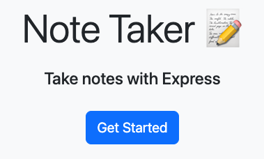
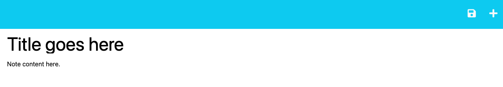
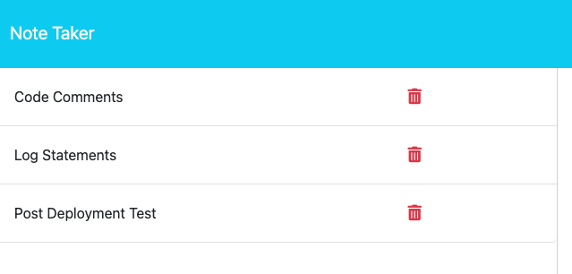

# Note Taker

## Description

This project is a web-based note keeping application. It has the ability to add, delete, and view notes all from a database. The notes recorded in this application will persist until they are deleted.

## Installation

Installation is not required. The webpage is accessible from any web browser at https://andrew-note-taker-bb31faaa2984.herokuapp.com/.

## Usage

To start using the Note Taker navigate to the website above and click on the 'Get Started' button.

To enter a new note, click in the title area and enter a title. Then click in the text area and add the content of your note. To save the note, click on the disc icon in the upper right corner. To clear any notes in the note creation area, click on the plus icon to start a new note.

The note will automatically be added to the saved note column upon save. To view the note, click on the title and the note will be displayed to the right. To delete a note click on the trash bin icon.

## Credits

Thanks goes to the University of Minnesota and Edx Bootcamp for providing the assistance and starter code needed to complete this project. 

## License

MIT License

Copyright (c) 2024 helm0127

Permission is hereby granted, free of charge, to any person obtaining a copy
of this software and associated documentation files (the "Software"), to deal
in the Software without restriction, including without limitation the rights
to use, copy, modify, merge, publish, distribute, sublicense, and/or sell
copies of the Software, and to permit persons to whom the Software is
furnished to do so, subject to the following conditions:

The above copyright notice and this permission notice shall be included in all
copies or substantial portions of the Software.

THE SOFTWARE IS PROVIDED "AS IS", WITHOUT WARRANTY OF ANY KIND, EXPRESS OR
IMPLIED, INCLUDING BUT NOT LIMITED TO THE WARRANTIES OF MERCHANTABILITY,
FITNESS FOR A PARTICULAR PURPOSE AND NONINFRINGEMENT. IN NO EVENT SHALL THE
AUTHORS OR COPYRIGHT HOLDERS BE LIABLE FOR ANY CLAIM, DAMAGES OR OTHER
LIABILITY, WHETHER IN AN ACTION OF CONTRACT, TORT OR OTHERWISE, ARISING FROM,
OUT OF OR IN CONNECTION WITH THE SOFTWARE OR THE USE OR OTHER DEALINGS IN THE
SOFTWARE.
